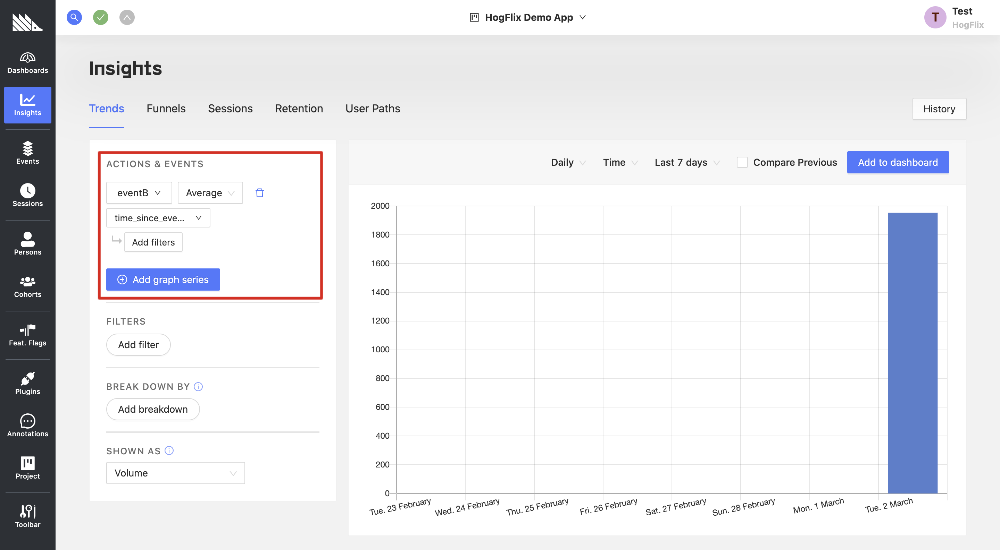

# Event Sequence Timer Plugin

Time the time taken for a user to perform Event B after performing Event A.

A property `time_since_eventA` will be added to `eventB`, with time measured in milliseconds.

## Example Usage



## Config

### List of events to track time differences on

The list of events is specified as follows:

```
(eventA,eventB),(eventC,eventD),(eventA,eventD)
```

Where the first event in a tuple is the event that "starts the timer" and the second event being the one that "finishes it". In other words, the first event happens before the second.

### Update timestamp on every new first event?

**Default:** `Yes`

If you select `Yes`, the stored timestamp for the first event will always be updated when a new event with the same name comes in (for the same user). This means your second event will always contain the difference between its time and the _last time_ the user triggered the first event.

If you select `No`, the stored timestamp will only be set once and never updated. This means you will get the difference between the time of the second event and the _first time_ the user triggered the first event.

#### Example 1:

**Config**

List of events to track time differences on: `(eventA,eventB)`
Update timestamp on every new first event? `Yes`

**User events**

```
eventA at t=0
eventA at t=2
eventB at t=4
```

**Result**

`eventB` will come with a property `time_since_eventA` equal to `2`.

#### Example 2:

**Config**

List of events to track time differences on: `(eventA,eventB)`
Update timestamp on every new first event? `No`

**User events**

```
eventA at t=0
eventA at t=2
eventB at t=4
```

**Result**

`eventB` will come with a property `time_since_eventA` equal to `4`.

